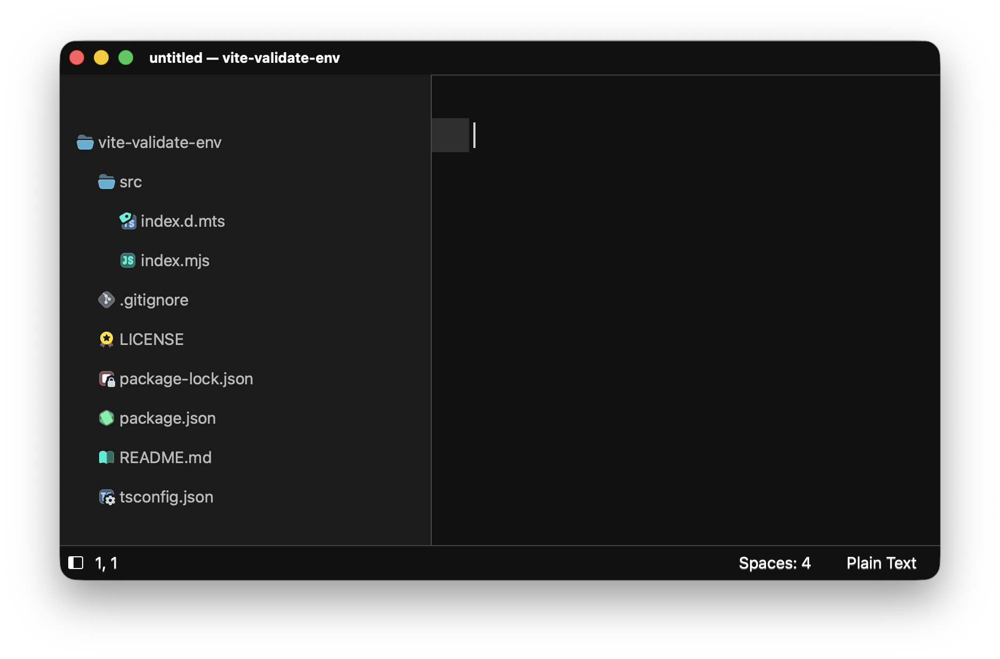

# Icons - Flow



## Getting started

Clone the repo in Sublime Text "Packages" folders:
```bash
git clone https://github.com/predragnikolic/flow-sublime-icons.git "Icons - Flow Dawn"
```
Select `Preferences: Settings` in the command palette and set:
```jsonc
// Preferences.sublime-settings
{
    "file_icon_theme": "Flow Dawn.sublime-file-icons"
}
```

Tweak your current theme, so the icons look nice.
Open the command palette and select `UI: Customize Theme`:
```jsonc
{
    "rules": [
        // Fix stretched file icons
        {
            "class": "icon_file_type",
            "content_margin": 8,
            "layer0.opacity": 1.0, // tweak opacity to your liking
            // "layer0.tint": [0, 0, 0, 150] // enable monochrome icons
        },

        // Change folder open/close icons
        // COLOR = teal | sky | red | purple | pink | orange | lime | green | gray | brown | blue | yellow
        {
            "class": "icon_folder",
            "layer0.texture": "Icons - Flow Dawn/icons/file_type_folder_gray.png", // file_type_folder_[COLOR].png
            "content_margin": 8,
            "layer0.opacity": 1.0 // tweak opacity to your liking
        },
        {
            "class": "icon_folder",
            "parents": [{"class": "tree_row", "attributes": ["expanded"]}],
            "layer0.texture": "Icons - Flow Dawn/icons/file_type_folder_gray_open.png", // file_type_folder_[COLOR]_open.png
        },

        // Hide arrow icons that are displayed next to folders
        {
            "class": "disclosure_button_control",
            "content_margin": 0
        },
    ]
}

```

## 💝 Thanks to

- [thang-nm/Flow-Icons](https://github.com/thang-nm/Flow-Icons)
- [BenjaminHalko/flow-icons-zed](https://github.com/BenjaminHalko/flow-icons-zed)


